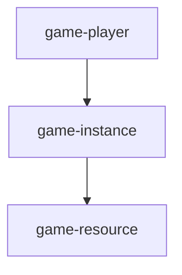

**Currently, in development.**

**Inggame is a minecraft plugin development framework based on Kotlin**

### **Use as a framework**

Inggame is able to run as a plugin supported framework


## layer-based data structure

| type     | description                                                                             | is repository |
|----------|-----------------------------------------------------------------------------------------|---------------|
| Layered  | Can be used to cache, load/unload                                                       | yes           |
| Resource | Load all from repository at start                                                       | yes           |
| Masked   | Can only reads current layer component, not it's parents                                | yes           |
| Multi    | Link other component from listed components. component will be selected by given key    | yes           |

## Read & Write interface

### arguments
| name      | description    |
|-----------|----------------|
| component | ServerResource |
| namespace | EventMessage   |
| key       | Greeting       |

### example 
`component.set(namespace, key, value)`
`component.get(namespace, key)`

```kotlin
fun setGreetingMessage() {
    resource.set("EventMessage", "Greeting", "Hello!")
}
fun greeting(player: Player) {
    player.sendMessage(resource.get("EventMessage", "Greeting"))
}        

```

